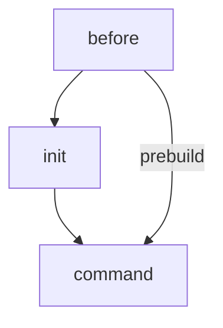

# Get started with PHP on GitPod
This is a starter repo for a PHP project running on GitPod. 
You can just open the IDE by clicking on: 
 
)

# Folders

Explanation of the folder structure: 

| Folder | Description |
| --- | --- |
| .gp | additional files required by Gitpod |
| .gp/conf | configuration files for applications (e.g. apache, nginx, php, mysql, etc.) |
| .gp/install | scripts for installing applications |
| .vscode | configuration files for VSCode |
| .gitpod.Dockerfile | custom docker image for Gitpod |
| .gitpod.yml | configuration file for Gitpod |
| data | application data |
| data/mysql | sql files for import to MySQL |
| www | document root of webserver |

Feel free to change the folder structure according to your needs. You may add folder for installation and init scripts in *.gp* or data files in *data*.

# Configuration

## Dockerfile

You can setup a customize Gitpod image using the *.gitpod.Dockerfile*. You are free to include any tools you need. 
Make sure the Dockerfile is referenced in *.gitpod.yml* so that the changes will be applied.

## Gitpod configuration

The configuration for Gitpod is in the *.gitpod.yml*. 
The most commonly used sections of the file are:

| Section | Description |
| --- | --- |
| image | choose an official image or reference the custom docker image |
| ports | configure visibility and action when a TCP port is opened |
| github | configure prebuilds and other github features |
| gitconfig | configure git client |
| vscode | configure vscode and extensions |
| tasks | define command that should be executed on startup |

The tasks section devides into 3 subsections:

| Section | Description |
| --- | --- |
| before | commands that are executed before any other subsection (e.g. set env var) |
| init | init commands (e.g. build, download dependencies, etc.) - is skipped when prebuilds are enabled |
| command | commands that are executed on startup (e.g. start webserver) |

This is a simple diagram of the execution order:

More information can be found on the official documentation pages of Gitpod: 
[Official Gitpod documentation - .gitpod.yml](https://www.gitpod.io/docs/configure)
